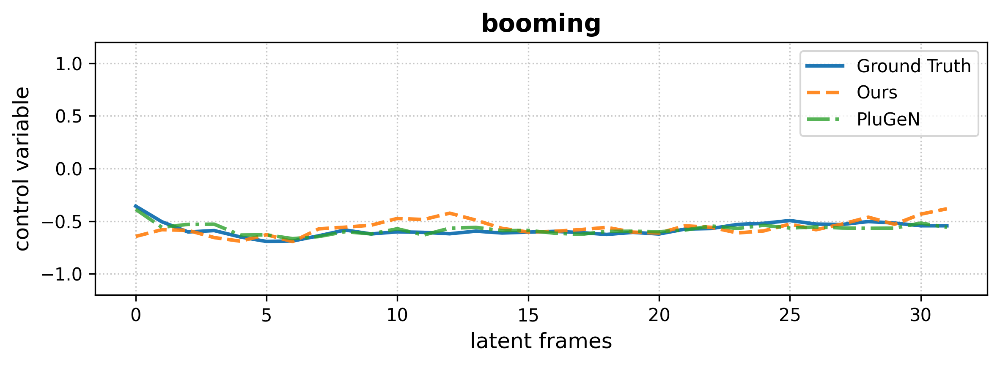
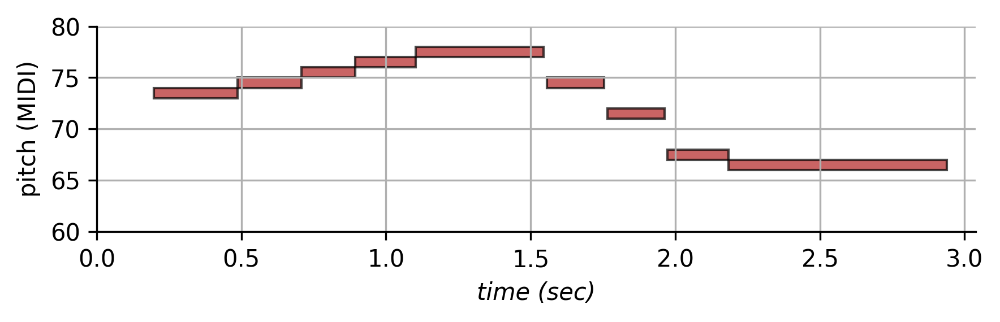

 

<h1>Adding temporal musical controls on top of pretrained generative models</h1>
Supporting webpage for ISMIR 2025.
Code is available <a href="https://github.com/anonymous4research1/tcplugen">here</a>.

 

*Note: This website is still under construction and will be updated soon.*

 

<h3>Abstract</h3>

Recent advances in deep generative modeling have enabled      high-quality models for musical audio synthesis. However, these approaches remain difficult to control, confined to simple, static attributes and, most importantly, entail retraining a different computationally-heavy architecture for each new control. This is inefficient and impractical as it requires substantial computational resources.\
In this paper, we propose a novel approach allowing to add time-varying musical controls on top of any pretrained generative models with an exposed latent space (e.g. neural audio codecs), without retraining or finetuning. Our method supports both discrete and continuous attributes by adapting a rectified flow approach with a latent diffusion transformer. We learn an invertible mapping between pretrained latent variables and a new space disentangling explicit control attributes and *style* variables that capture the remaining factors of variation.\
This enables both feature extraction from an input, but also editing those features to generate transformed audio samples. Finally, this also introduces the ability to perform synthesis directly from the audio descriptors. We validate our method with 4 datasets going from different musical instruments up to full music recordings, on which we outperform state-of-the-art task-specific baselines in terms of both generation quality and accuracy of the control by inferring transferred attributes.

 
 

<b>Figure 1: </b>Our approach enhances pretrained neural codecs with a new control-style space supporting both discrete and continuous time-varying musical controls, enabling features extraction, audio editing and conditional synthesis.

 
 

<b>Figure 2: </b>Detailed overview of our approach mapping pretrained latent trajectories to explicit control and style variables using rectified flow.

Here, we provide audio examples and additional results to complete the experiments section from the paper and illustrate the control abilities of our proposed method. We organise the results into 3 parts corresponding to our 3 target tasks:
- [Features extraction](#features-extraction)
- [Audio editing](#audio-editing)
- [Conditional synthesis](#conditional-synthesis)

# Features extraction

### Results on MedleySolos:

We compare our method with the PluGeN<a href="#note1" id="note1ref">[1]</a> baseline for the musical features extraction task on the [MedleySolos](https://adasp.telecom-paris.fr/resources/2018-09-28-medley-solos-db/) dataset while using the same pretrained codec Music2Latent<a href="#note2" id="note2ref">[2]</a>.

The models were trained on time-varying and static attributes, both discrete and continuous, with the following control features: *melody* (from the MIDI), *instrument* (label), *loudness*, *bandwidth*, *booming*, *sharpness*. Here, we show some results for extracting these features from an input audio sample. The blue curves represent the groudtruth control signals while the orange and green ones correpond to the attributes inferred by our method and PluGeN<a href="#note1" id="note1ref">[1]</a> respectively.

We provide an example for each category of instruments which are : 
- female singer
- violin
- flute
- clarinet
- tenor saxophone
- trumpet

Scroll to see all the results if necessary.

<table class="table table-sm text-center" style="vertical-align: middle;">
  <colgroup>
      <col style="width: 200px;">
      <col style="width: 200px;">
      <col style="width: 600px;">
      <col style="width: 600px;">
      <col style="width: 600px;">
      <col style="width: 600px;">
      <col style="width: 600px;">
      <col style="width: 600px;">
    </colgroup>
  <thead>
    <tr>
      <th style="text-align:center;"></th>
      <th style="text-align:center;">Audio (GT)</th>
      <th style="text-align:center;">pitch</th>
      <th style="text-align:center;">instrument</th>
      <th style="text-align:center;">loudness</th>
      <th style="text-align:center;">bandwidth</th>
      <th style="text-align:center;">booming</th>
      <th style="text-align:center;">sharpness</th>
    </tr>
  </thead>
  <tbody>
  <tr>
    <td>1</td>
    <td><audio src="assets/results/medley_solos/feat_ext/83/83_audio_input.wav" controls style="width: 200px"></audio></td>
    <td></td>
    <td></td>
    <td></td>
    <td></td>
    <td></td>
    <td></td>
    <td></td>
  </tr>
  <tr>
    <td>2</td>
    <td><audio src="assets/results/medley_solos/feat_ext/50/50_audio_input.wav" controls style="width: 200px"></audio></td>
    <td></td>
    <td></td>
    <td></td>
    <td></td>
    <td></td>
    <td></td>
    <td></td>
  </tr>
  <tr>
    <td>3</td>
    <td><audio src="assets/results/medley_solos/feat_ext/1/1_audio_input.wav" controls style="width: 200px"></audio></td>
    <td></td>
    <td></td>
    <td></td>
    <td></td>
    <td></td>
    <td></td>
    <td></td>
  </tr>
  <tr>
    <td>4</td>
    <td><audio src="assets/results/medley_solos/feat_ext/607/607_audio_input.wav" controls style="width: 200px"></audio></td>
    <td></td>
    <td></td>
    <td></td>
    <td></td>
    <td></td>
    <td></td>
    <td></td>
  </tr>
  <tr>
    <td>5</td>
    <td><audio src="assets/results/medley_solos/feat_ext/96/96_audio_input.wav" controls style="width: 200px"></audio></td>
    <td></td>
    <td></td>
    <td></td>
    <td></td>
    <td></td>
    <td></td>
    <td></td>
  </tr>
  <tr>
    <td>6</td>
    <td><audio src="assets/results/medley_solos/feat_ext/108/108_audio_input.wav" controls style="width: 200px"></audio></td>
    <td></td>
    <td></td>
    <td></td>
    <td></td>
    <td></td>
    <td></td>
    <td></td>
  </tr>
  </tbody>
</table> 

# Audio editing

### Results on Medley Solos:

We compare our method with the PluGeN<a href="#note1" id="note1ref">[1]</a> and AFTER<a href="#note3" id="note3ref">[3]</a> baselines for the audio editing task on the [MedleySolos](https://adasp.telecom-paris.fr/resources/2018-09-28-medley-solos-db/) dataset while using the same pretrained codec Music2Latent<a href="#note2" id="note2ref">[2]</a>.

The models provide control on the *melody* (from the MIDI information extracted with BasicPitch<a href="#note4" id="note4ref">[4]</a>) and the *instrument* type (from the label). We infer the *control-style* representation from a "source" audio file, then, we change either the melody or the instrument type taken from another "target" audio sample while keeping the *style* vector inferred from the source, and finally, we use the updated representation to generate the new waveform.

For instrument editing with AFTER<a href="#note3" id="note3ref">[3]</a>, we consider the timber embedding (which is 64-dimensional) as the instrument type control input. To fully compare with our 1-dimensional control representation, we also provide the audio generated using the *style* representation of the target audio sample (e.g. *"Ours (with style from target)"*). This enables to perceive if information related to the instrument remains in the *style* representation. 

Scroll to see all the results if necessary.

<table class="table table-sm text-center" style="vertical-align: middle;">
  <colgroup>
    <col style="width: 200px;">
      <col style="width: 200px;">
      <col style="width: 200px;">
      <col style="width: 200px;">
      <col style="width: 200px;">
      <col style="width: 200px;">
      <col style="width: 200px;">
      <col style="width: 200px;">
      <col style="width: 600px;">
    </colgroup>
  <thead>
    <tr>
      <th style="text-align:center;"></th>
      <th style="text-align:center;">Source</th>
      <th style="text-align:center;">Target</th>
      <th style="text-align:center;"></th>
      <th style="text-align:center;">PluGeN</th>
      <th style="text-align:center;">AFTER</th>
      <th style="text-align:center;">Ours</th>
      <th style="text-align:center;">Ours (with style from target)</th>
      <th style="text-align:center;">Target Features inference</th>
    </tr>
  </thead>
  <tbody>

  <tr>
    <td rowspan="2">1</td>
    <td rowspan="2"><audio src="assets/results/medley_solos/edit/83_560/source_83_female singer.wav" controls style="width: 200px"></audio></td>
    <td rowspan="2"><audio src="assets/results/medley_solos/edit/83_560/target_560_violin.wav" controls style="width: 200px"></audio></td>
    <td>instrument</td>
    <td><audio src="assets/results/medley_solos/edit/83_560/83_560_edit_inst_female singer_violin_plugen.wav" controls style="width: 200px"></audio></td>
    <td><audio src="assets/results/medley_solos/edit/83_560/83_560_edit_inst_female singer_violin_after.wav" controls style="width: 200px"></audio></td>
    <td><audio src="assets/results/medley_solos/edit/83_560/83_560_edit_inst_female singer_violin_ours.wav" controls style="width: 200px"></audio></td>
    <td><audio src="assets/results/medley_solos/edit/83_560/83_560_edit_inst_female singer_violin_ours_style_target.wav" controls style="width: 200px"></audio></td>
    <td></td>
  </tr>
  <tr>
    <td>melody</td>
    <td><audio src="assets/results/medley_solos/edit/83_560/83_560_edit_mel_plugen.wav" controls style="width: 200px"></audio></td>
    <td><audio src="assets/results/medley_solos/edit/83_560/83_560_edit_mel_after.wav" controls style="width: 200px"></audio></td>
    <td><audio src="assets/results/medley_solos/edit/83_560/83_560_edit_mel_ours.wav" controls style="width: 200px"></audio></td>
    <td><audio src="assets/results/medley_solos/edit/83_560/83_560_edit_mel_ours_style_target.wav" controls style="width: 200px"></audio></td>
    <td></td>
  </tr>

  <tr>
    <td rowspan="2">2</td>
    <td rowspan="2"><audio src="assets/results/medley_solos/edit/174_50/source_174_flute.wav" controls style="width: 200px"></audio></td>
    <td rowspan="2"><audio src="assets/results/medley_solos/edit/174_50/target_50_violin.wav" controls style="width: 200px"></audio></td>
    <td>instrument</td>
    <td><audio src="assets/results/medley_solos/edit/174_50/174_50_edit_inst_flute_violin_plugen.wav" controls style="width: 200px"></audio></td>
    <td><audio src="assets/results/medley_solos/edit/174_50/174_50_edit_inst_flute_violin_after.wav" controls style="width: 200px"></audio></td>
    <td><audio src="assets/results/medley_solos/edit/174_50/174_50_edit_inst_flute_violin_ours.wav" controls style="width: 200px"></audio></td>
    <td><audio src="assets/results/medley_solos/edit/174_50/174_50_edit_inst_flute_violin_ours_style_target.wav" controls style="width: 200px"></audio></td>
    <td></td>
  </tr>
  <tr>
    <td>melody</td>
    <td><audio src="assets/results/medley_solos/edit/174_50/174_50_edit_mel_plugen.wav" controls style="width: 200px"></audio></td>
    <td><audio src="assets/results/medley_solos/edit/174_50/174_50_edit_mel_after.wav" controls style="width: 200px"></audio></td>
    <td><audio src="assets/results/medley_solos/edit/174_50/174_50_edit_mel_ours.wav" controls style="width: 200px"></audio></td>
    <td><audio src="assets/results/medley_solos/edit/174_50/174_50_edit_mel_ours_style_target.wav" controls style="width: 200px"></audio></td>
    <td></td>
  </tr>

  <tr>
    <td rowspan="2">3</td>
    <td rowspan="2"><audio src="assets/results/medley_solos/edit/202_652/source_202_violin.wav" controls style="width: 200px"></audio></td>
    <td rowspan="2"><audio src="assets/results/medley_solos/edit/202_652/target_652_trumpet.wav" controls style="width: 200px"></audio></td>
    <td>instrument</td>
    <td><audio src="assets/results/medley_solos/edit/202_652/202_652_edit_inst_violin_trumpet_plugen.wav" controls style="width: 200px"></audio></td>
    <td><audio src="assets/results/medley_solos/edit/202_652/202_652_edit_inst_violin_trumpet_after.wav" controls style="width: 200px"></audio></td>
    <td><audio src="assets/results/medley_solos/edit/202_652/202_652_edit_inst_violin_trumpet_ours.wav" controls style="width: 200px"></audio></td>
    <td><audio src="assets/results/medley_solos/edit/202_652/202_652_edit_inst_violin_trumpet_ours_style_target.wav" controls style="width: 200px"></audio></td>
    <td></td>
  </tr>
  <tr>
    <td>melody</td>
    <td><audio src="assets/results/medley_solos/edit/202_652/202_652_edit_mel_plugen.wav" controls style="width: 200px"></audio></td>
    <td><audio src="assets/results/medley_solos/edit/202_652/202_652_edit_mel_after.wav" controls style="width: 200px"></audio></td>
    <td><audio src="assets/results/medley_solos/edit/202_652/202_652_edit_mel_ours.wav" controls style="width: 200px"></audio></td>
    <td><audio src="assets/results/medley_solos/edit/202_652/202_652_edit_mel_ours_style_target.wav" controls style="width: 200px"></audio></td>
    <td></td>
  </tr>
  <!-- okkk -->
  

  <tr>
    <td rowspan="2">4</td>
    <td rowspan="2"><audio src="assets/results/medley_solos/edit/595_286/source_595_violin.wav" controls style="width: 200px"></audio></td>
    <td rowspan="2"><audio src="assets/results/medley_solos/edit/595_286/target_286_flute.wav" controls style="width: 200px"></audio></td>
    <td>instrument</td>
    <td><audio src="assets/results/medley_solos/edit/595_286/595_286_edit_inst_violin_flute_plugen.wav" controls style="width: 200px"></audio></td>
    <td><audio src="assets/results/medley_solos/edit/595_286/595_286_edit_inst_violin_flute_after.wav" controls style="width: 200px"></audio></td>
    <td><audio src="assets/results/medley_solos/edit/595_286/595_286_edit_inst_violin_flute_ours.wav" controls style="width: 200px"></audio></td>
    <td><audio src="assets/results/medley_solos/edit/595_286/595_286_edit_inst_violin_flute_ours_style_target.wav" controls style="width: 200px"></audio></td>
    <td></td>
  </tr>
  <tr>
    <td>melody</td>
    <td><audio src="assets/results/medley_solos/edit/595_286/595_286_edit_mel_plugen.wav" controls style="width: 200px"></audio></td>
    <td><audio src="assets/results/medley_solos/edit/595_286/595_286_edit_mel_after.wav" controls style="width: 200px"></audio></td>
    <td><audio src="assets/results/medley_solos/edit/595_286/595_286_edit_mel_ours.wav" controls style="width: 200px"></audio></td>
    <td><audio src="assets/results/medley_solos/edit/595_286/595_286_edit_mel_ours_style_target.wav" controls style="width: 200px"></audio></td>
    <td></td>
  </tr>

  <tr>
    <td rowspan="2">5</td>
    <td rowspan="2"><audio src="assets/results/medley_solos/edit/607_595/source_607_clarinet.wav" controls style="width: 200px"></audio></td>
    <td rowspan="2"><audio src="assets/results/medley_solos/edit/607_595/target_595_violin.wav" controls style="width: 200px"></audio></td>
    <td>instrument</td>
    <td><audio src="assets/results/medley_solos/edit/607_595/607_595_edit_inst_clarinet_violin_plugen.wav" controls style="width: 200px"></audio></td>
    <td><audio src="assets/results/medley_solos/edit/607_595/607_595_edit_inst_clarinet_violin_after.wav" controls style="width: 200px"></audio></td>
    <td><audio src="assets/results/medley_solos/edit/607_595/607_595_edit_inst_clarinet_violin_ours.wav" controls style="width: 200px"></audio></td>
    <td><audio src="assets/results/medley_solos/edit/607_595/607_595_edit_inst_clarinet_violin_ours_style_target.wav" controls style="width: 200px"></audio></td>
    <td></td>
  </tr>
  <tr>
    <td>melody</td>
    <td><audio src="assets/results/medley_solos/edit/607_595/607_595_edit_mel_plugen.wav" controls style="width: 200px"></audio></td>
    <td><audio src="assets/results/medley_solos/edit/607_595/607_595_edit_mel_after.wav" controls style="width: 200px"></audio></td>
    <td><audio src="assets/results/medley_solos/edit/607_595/607_595_edit_mel_ours.wav" controls style="width: 200px"></audio></td>
    <td><audio src="assets/results/medley_solos/edit/607_595/607_595_edit_mel_ours_style_target.wav" controls style="width: 200px"></audio></td>
    <td></td>
  </tr>

  <tr>
    <td rowspan="2">6</td>
    <td rowspan="2"><audio src="assets/results/medley_solos/edit/652_83/source_652_trumpet.wav" controls style="width: 200px"></audio></td>
    <td rowspan="2"><audio src="assets/results/medley_solos/edit/652_83/target_83_female singer.wav" controls style="width: 200px"></audio></td>
    <td>instrument</td>
    <td><audio src="assets/results/medley_solos/edit/652_83/652_83_edit_inst_trumpet_female singer_plugen.wav" controls style="width: 200px"></audio></td>
    <td><audio src="assets/results/medley_solos/edit/652_83/652_83_edit_inst_trumpet_female singer_after.wav" controls style="width: 200px"></audio></td>
    <td><audio src="assets/results/medley_solos/edit/652_83/652_83_edit_inst_trumpet_female singer_ours.wav" controls style="width: 200px"></audio></td>
    <td><audio src="assets/results/medley_solos/edit/652_83/652_83_edit_inst_trumpet_female singer_ours_style_target.wav" controls style="width: 200px"></audio></td>
    <td></td>
  </tr>
  <tr>
    <td>melody</td>
    <td><audio src="assets/results/medley_solos/edit/652_83/652_83_edit_mel_plugen.wav" controls style="width: 200px"></audio></td>
    <td><audio src="assets/results/medley_solos/edit/652_83/652_83_edit_mel_after.wav" controls style="width: 200px"></audio></td>
    <td><audio src="assets/results/medley_solos/edit/652_83/652_83_edit_mel_ours.wav" controls style="width: 200px"></audio></td>
    <td><audio src="assets/results/medley_solos/edit/652_83/652_83_edit_mel_ours_style_target.wav" controls style="width: 200px"></audio></td>
    <td></td>
  </tr>

  

  <!-- <tr>
    <td rowspan="2">2</td>
    <td rowspan="2"><audio src=".wav" controls style="width: 200px"></audio></td>
    <td rowspan="2"><audio src=".wav" controls style="width: 200px"></audio></td>
    <td>melody</td>
    <td><audio src=".wav" controls style="width: 200px"></audio></td>
    <td><audio src=".wav" controls style="width: 200px"></audio></td>
    <td><audio src=".wav" controls style="width: 200px"></audio></td>
    <td></td>
  </tr>
  <tr>
    <td>instrument</td>
    <td><audio src=".wav" controls style="width: 200px"></audio></td>
    <td><audio src=".wav" controls style="width: 200px"></audio></td>
    <td><audio src=".wav" controls style="width: 200px"></audio></td>
    <td></td>
  </tr> -->

  </tbody>
</table>

# Conditional synthesis

### Results on Medley Solos:

We compare our method with the PluGeN<a href="#note1" id="note1ref">[1]</a> and AFTER<a href="#note3" id="note3ref">[3]</a> baselines for the conditional synthesis task on the [MedleySolos](https://adasp.telecom-paris.fr/resources/2018-09-28-medley-solos-db/) dataset while using the same pretrained codec Music2Latent<a href="#note2" id="note2ref">[2]</a>.

The models provide control on the *melody* (from the MIDI information extracted with BasicPitch<a href="#note4" id="note4ref">[4]</a>) and the *instrument* type (from the label). We directly use a MIDI file and an instrument label to define the *control* signals and we sample the *style* representation from a standard Gaussian distribution, and finally generate the audio waveform.

*Note*: Similarly to audio editing, for AFTER<a href="#note3" id="note3ref">[3]</a> we consider the timber embedding (which is 64-dimensional) to condition the instrument type by directly using an audio file representing the targeted instrument.

Scroll to see all the results if necessary.

<table class="table table-sm text-center" style="vertical-align: middle;">
  <colgroup>
      <col style="width: 200px;">
      <col style="width: 600px;">
      <col style="width: 200px;">
      <col style="width: 200px;">
      <col style="width: 200px;">
      <col style="width: 700px;">
    </colgroup>
  <thead>
    <tr>
      <th style="text-align:center;"></th>
      <th style="text-align:center;">Melody (MIDI)</th>
      <th style="text-align:center;">Instrument label</th>
      <th style="text-align:center;">PluGeN</th>
      <th style="text-align:center;">AFTER</th>
      <th style="text-align:center;">Ours (with different styles)</th>
    </tr>
  </thead>
  <tbody>
  <tr>
    <td>1</td>
    <td>   <audio src="assets/results/medley_solos/cond_synth/23_50/23_50_violin_midi.wav" controls style="width: 200px"></audio></td>
    <td style="text-align:center;"><b>violin</b></td>
    <td><audio src="assets/results/medley_solos/cond_synth/23_50/23_50_violin_plugen.wav" controls style="width: 200px"></audio></td>
    <td><audio src="assets/results/medley_solos/cond_synth/23_50/23_50_violin_after.wav" controls style="width: 200px"></audio></td>
    <td><audio src="assets/results/medley_solos/cond_synth/23_50/23_50_violin_ours_style1.wav" controls style="width: 200px"></audio><audio src="assets/results/medley_solos/cond_synth/23_50/23_50_violin_ours_style2.wav" controls style="width: 200px"></audio><audio src="assets/results/medley_solos/cond_synth/23_50/23_50_violin_ours_style3.wav" controls style="width: 200px"></audio></td>
  </tr>
  <tr>
    <td>2</td>
    <td>   <audio src="assets/results/medley_solos/cond_synth/286_50/286_50_violin_midi.wav" controls style="width: 200px"></audio></td>
    <td style="text-align:center;"><b>violin</b></td>
    <td><audio src="assets/results/medley_solos/cond_synth/286_50/286_50_violin_plugen.wav" controls style="width: 200px"></audio></td>
    <td><audio src="assets/results/medley_solos/cond_synth/286_50/286_50_violin_after.wav" controls style="width: 200px"></audio></td>
    <td><audio src="assets/results/medley_solos/cond_synth/286_50/286_50_violin_ours_style1.wav" controls style="width: 200px"></audio><audio src="assets/results/medley_solos/cond_synth/286_50/286_50_violin_ours_style2.wav" controls style="width: 200px"></audio><audio src="assets/results/medley_solos/cond_synth/286_50/286_50_violin_ours_style3.wav" controls style="width: 200px"></audio></td>
  </tr>

  <tr>
    <td>3</td>
    <td>   <audio src="assets/results/medley_solos/cond_synth/560_83/560_83_female singer_midi.wav" controls style="width: 200px"></audio></td>
    <td style="text-align:center;"><b>female singer</b></td>
    <td><audio src="assets/results/medley_solos/cond_synth/560_83/560_83_female singer_plugen.wav" controls style="width: 200px"></audio></td>
    <td><audio src="assets/results/medley_solos/cond_synth/560_83/560_83_female singer_after.wav" controls style="width: 200px"></audio></td>
    <td><audio src="assets/results/medley_solos/cond_synth/560_83/560_83_female singer_ours_style1.wav" controls style="width: 200px"></audio><audio src="assets/results/medley_solos/cond_synth/560_83/560_83_female singer_ours_style2.wav" controls style="width: 200px"></audio><audio src="assets/results/medley_solos/cond_synth/560_83/560_83_female singer_ours_style3.wav" controls style="width: 200px"></audio></td>
  </tr>
  <tr>
    <td>4</td>
    <td>   <audio src="assets/results/medley_solos/cond_synth/108_83/108_83_female singer_midi.wav" controls style="width: 200px"></audio></td>
    <td style="text-align:center;"><b>female singer</b></td>
    <td><audio src="assets/results/medley_solos/cond_synth/108_83/108_83_female singer_plugen.wav" controls style="width: 200px"></audio></td>
    <td><audio src="assets/results/medley_solos/cond_synth/108_83/108_83_female singer_after.wav" controls style="width: 200px"></audio></td>
    <td><audio src="assets/results/medley_solos/cond_synth/108_83/108_83_female singer_ours_style1.wav" controls style="width: 200px"></audio><audio src="assets/results/medley_solos/cond_synth/108_83/108_83_female singer_ours_style2.wav" controls style="width: 200px"></audio><audio src="assets/results/medley_solos/cond_synth/108_83/108_83_female singer_ours_style3.wav" controls style="width: 200px"></audio></td>
  </tr>

  <tr>
    <td>5</td>
    <td>   <audio src="assets/results/medley_solos/cond_synth/50_1/50_1_flute_midi.wav" controls style="width: 200px"></audio></td>
    <td style="text-align:center;"><b>flute</b></td>
    <td><audio src="assets/results/medley_solos/cond_synth/50_1/50_1_flute_plugen.wav" controls style="width: 200px"></audio></td>
    <td><audio src="assets/results/medley_solos/cond_synth/50_1/50_1_flute_after.wav" controls style="width: 200px"></audio></td>
    <td><audio src="assets/results/medley_solos/cond_synth/50_1/50_1_flute_ours_style1.wav" controls style="width: 200px"></audio><audio src="assets/results/medley_solos/cond_synth/50_1/50_1_flute_ours_style2.wav" controls style="width: 200px"></audio><audio src="assets/results/medley_solos/cond_synth/50_1/50_1_flute_ours_style3.wav" controls style="width: 200px"></audio></td>
  </tr>

  <tr>
    <td>6</td>
    <td>   <audio src="assets/results/medley_solos/cond_synth/652_96/652_96_tenor saxophone_midi.wav" controls style="width: 200px"></audio></td>
    <td style="text-align:center;"><b>tenor saxophone</b></td>
    <td><audio src="assets/results/medley_solos/cond_synth/652_96/652_96_tenor saxophone_plugen.wav" controls style="width: 200px"></audio></td>
    <td><audio src="assets/results/medley_solos/cond_synth/652_96/652_96_tenor saxophone_after.wav" controls style="width: 200px"></audio></td>
    <td><audio src="assets/results/medley_solos/cond_synth/652_96/652_96_tenor saxophone_ours_style1.wav" controls style="width: 200px"></audio><audio src="assets/results/medley_solos/cond_synth/652_96/652_96_tenor saxophone_ours_style2.wav" controls style="width: 200px"></audio><audio src="assets/results/medley_solos/cond_synth/652_96/652_96_tenor saxophone_ours_style3.wav" controls style="width: 200px"></audio></td>
  </tr>

<tr>
    <td>7</td>
    <td>   <audio src="assets/results/medley_solos/cond_synth/607_108/607_108_trumpet_midi.wav" controls style="width: 200px"></audio></td>
    <td style="text-align:center;"><b>trumpet</b></td>
    <td><audio src="assets/results/medley_solos/cond_synth/607_108/607_108_trumpet_plugen.wav" controls style="width: 200px"></audio></td>
    <td><audio src="assets/results/medley_solos/cond_synth/607_108/607_108_trumpet_after.wav" controls style="width: 200px"></audio></td>
    <td><audio src="assets/results/medley_solos/cond_synth/607_108/607_108_trumpet_ours_style1.wav" controls style="width: 200px"></audio><audio src="assets/results/medley_solos/cond_synth/607_108/607_108_trumpet_ours_style2.wav" controls style="width: 200px"></audio><audio src="assets/results/medley_solos/cond_synth/607_108/607_108_trumpet_ours_style3.wav" controls style="width: 200px"></audio></td>
</tr>

<tr>
    <td>8</td>
    <td>   <audio src="assets/results/medley_solos/cond_synth/553_500/553_500_clarinet_midi.wav" controls style="width: 200px"></audio></td>
    <td style="text-align:center;"><b>clarinet</b></td>
    <td><audio src="assets/results/medley_solos/cond_synth/553_500/553_500_clarinet_plugen.wav" controls style="width: 200px"></audio></td>
    <td><audio src="assets/results/medley_solos/cond_synth/553_500/553_500_clarinet_after.wav" controls style="width: 200px"></audio></td>
    <td><audio src="assets/results/medley_solos/cond_synth/553_500/553_500_clarinet_ours_style1.wav" controls style="width: 200px"></audio><audio src="assets/results/medley_solos/cond_synth/553_500/553_500_clarinet_ours_style2.wav" controls style="width: 200px"></audio><audio src="assets/results/medley_solos/cond_synth/553_500/553_500_clarinet_ours_style3.wav" controls style="width: 200px"></audio></td>
</tr>

  <!-- <tr>
    <td>1</td>
    <td><audio src=".wav" controls style="width: 200px"></audio></td>
    <td style="text-align:center;"><b>violin</b></td>
    <td><audio src=".wav" controls style="width: 200px"></audio></td>
    <td><audio src=".wav" controls style="width: 200px"></audio></td>
    <td><audio src=".wav" controls style="width: 200px"></audio><audio src=".wav" controls style="width: 200px"></audio><audio src=".wav" controls style="width: 200px"></audio></td>
  </tr> -->
  </tbody>
</table> 

## References 

<a id="note1" href="#note1ref">[1]</a> M. Wołczyk, M. Proszewska, Ł. Maziarka, M. Zieba, P. Wielopolski, R. Kurczab, and M. Smieja, “Plugen: Multi-label conditional generation from pre-trained models,” in Proceedings of the AAAI Conference on Artificial Intelligence, vol. 36, no. 8, 2022, pp. 8647–8656.

<a id="note2" href="#note2ref">[2]</a> M. Pasini, S. Lattner, and G. Fazekas, “Music2latent: Consistency autoencoders for latent audio compression,” in International Society for Music Information Retrieval, ISMIR 2024, 2024.

<a id="note3" href="#note3ref">[3]</a> N. Demerlé, P. Esling, G. Doras, and D. Genova, “Combining audio control and style transfer using latent diffusion,” in International Society for Music Information Retrieval, ISMIR 2024, 2024.

<a id="note4" href="#note4ref">[4]</a> R.M.Bittner, J.J.Bosch, D.Rubinstein, G.Meseguer-Brocal, and S. Ewert, “A lightweight instrument-agnostic model for polyphonic note transcription and multipitch estimation,” in Proceedings of the IEEE International Conference on Acoustics, Speech, and Signal Processing (ICASSP), Singapore, 2022.
